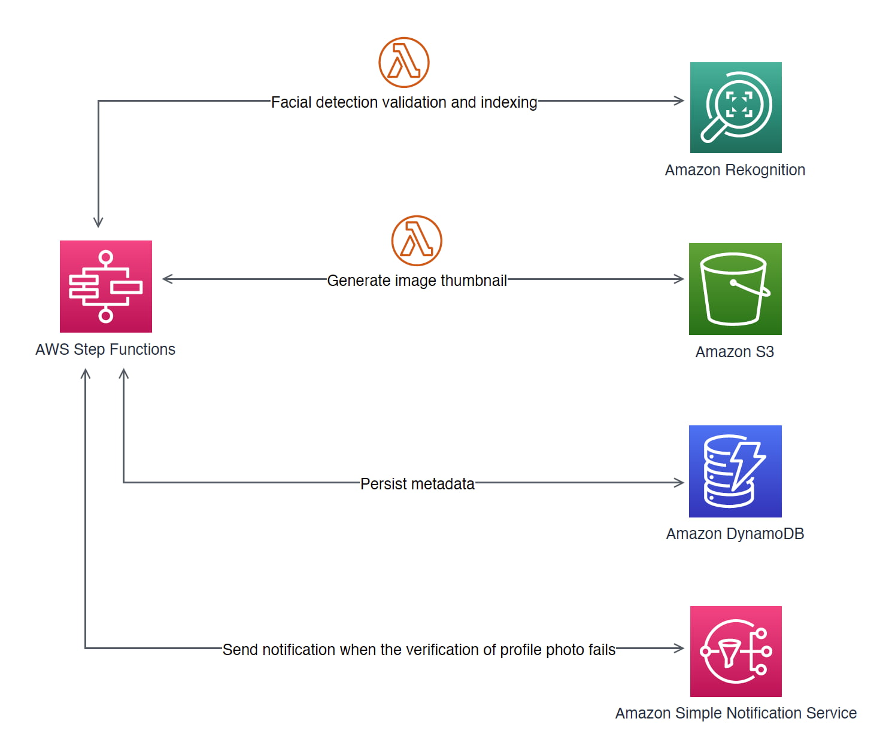
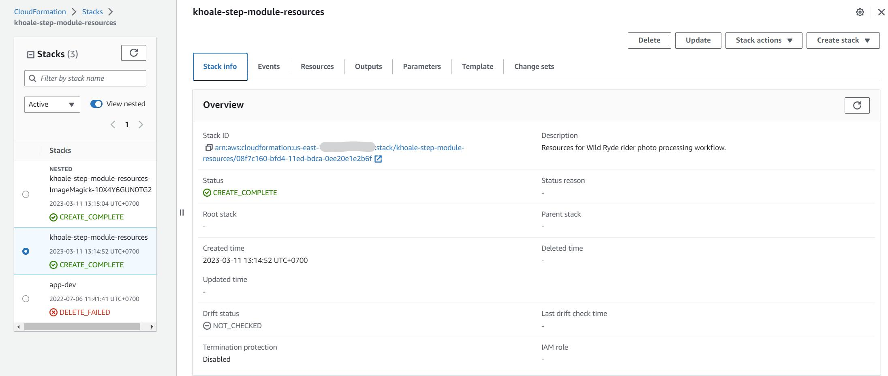
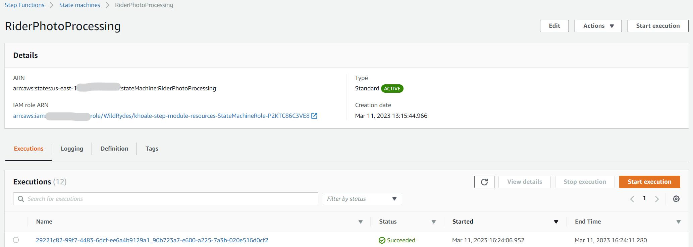
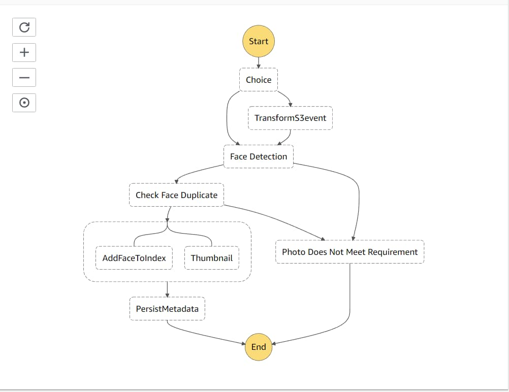

As mentioned in the [last article](/blog/010-hello-aws-step-functions), We will
follow the AWS workshop https://www.image-processing.serverlessworkshops.io/ to
build a real AWS Serverless Project with AWS Step Functions.

This is the structure that we gonna build.



Follow the workshop, The main sam.yaml file located in here:
https://gist.githubusercontent.com/khoa-le/98855ac969c8b3c7eb3dfa2cce68de12/raw/ac1373b6b35a678450b47e727d7741a54c5c8ed1/sam_220615.yaml

You can download and take a look on those configuration and to apply
successfully you should choose the region us-east-1 because the yaml file for
us-east-1 configured.

The Cloudformation created look likes:



The Step functions after finished the workshop



The Step functions definition



Here is the khoale-step-module-resources-FaceDetectionFunction lambda

```js
const util = require('util')
const AWS = require('aws-sdk')
const rekognition = new AWS.Rekognition()

exports.handler = (event, context, callback) => {
  console.log('Reading input from event:\n', util.inspect(event, {depth: 5}))

  const srcBucket = event.s3Bucket
  // Object key may have spaces or unicode non-ASCII characters.
  const srcKey = decodeURIComponent(event.s3Key.replace(/\+/g, ' '))

  var params = {
    Image: {
      S3Object: {
        Bucket: srcBucket,
        Name: srcKey,
      },
    },
    Attributes: ['ALL'],
  }

  rekognition
    .detectFaces(params)
    .promise()
    .then(data => {
      console.log(
        'Detection result from rekognition:\n',
        util.inspect(data, {depth: 5}),
      )
      if (data.FaceDetails.length != 1) {
        callback(
          new PhotoDoesNotMeetRequirementError(
            'Detected ' + data.FaceDetails.length + ' faces in the photo.',
          ),
        )
      }
      if (data.FaceDetails[0].Sunglasses.Value === true) {
        callback(
          new PhotoDoesNotMeetRequirementError('Face is wearing sunglasses'),
        )
      }
      var detectedFaceDetails = data.FaceDetails[0]

      // remove some fields not used in further processing to de-clutter the output.
      delete detectedFaceDetails['Landmarks']

      callback(null, detectedFaceDetails)
    })
    .catch(err => {
      console.log(err)
      if (err.code === 'ImageTooLargeException') {
        callback(new PhotoDoesNotMeetRequirementError(err.message))
      }
      if (err.code === 'InvalidImageFormatException') {
        callback(
          new PhotoDoesNotMeetRequirementError(
            'Unsupported image file format. Only JPEG or PNG is supported',
          ),
        )
      }
      callback(err)
    })
}

function PhotoDoesNotMeetRequirementError(message) {
  this.name = 'PhotoDoesNotMeetRequirementError'
  this.message = message
}
PhotoDoesNotMeetRequirementError.prototype = new Error()
```

Here is the khoale-step-module-resources-FaceSearchFunction lambda

```js
const util = require('util')
const AWS = require('aws-sdk')
const rekognition = new AWS.Rekognition()

exports.handler = (event, context, callback) => {
  console.log('Reading input from event:\n', util.inspect(event, {depth: 5}))

  const srcBucket = event.s3Bucket
  // Object key may have spaces or unicode non-ASCII characters.
  const srcKey = decodeURIComponent(event.s3Key.replace(/\+/g, ' '))

  var params = {
    CollectionId: process.env.REKOGNITION_COLLECTION_ID,
    Image: {
      S3Object: {
        Bucket: srcBucket,
        Name: srcKey,
      },
    },
    FaceMatchThreshold: 70.0,
    MaxFaces: 3,
  }
  rekognition
    .searchFacesByImage(params)
    .promise()
    .then(data => {
      if (data.FaceMatches.length > 0) {
        callback(new FaceAlreadyExistsError())
      } else {
        callback(null, null)
      }
    })
    .catch(err => {
      callback(err)
    })
}

function FaceAlreadyExistsError() {
  this.name = 'FaceAlreadyExistsError'
  this.message = 'Face in the picture is already in the system. '
}
FaceAlreadyExistsError.prototype = new Error()
```

Here is the khoale-step-module-resources-ThumbnailFunction lambda

```js
// dependencies
const AWS = require('aws-sdk')
const gm = require('gm').subClass({imageMagick: true}) // Enable ImageMagick integration.
const util = require('util')
const Promise = require('bluebird')
Promise.promisifyAll(gm.prototype)

// constants
const MAX_WIDTH = process.env.MAX_WIDTH ? process.env.MAX_WIDTH : 250
const MAX_HEIGHT = process.env.MAX_HEIGHT ? process.env.MAX_HEIGHT : 250

const thumbnailBucket = process.env.THUMBNAIL_BUCKET

// get reference to S3 client
const s3 = new AWS.S3()

exports.handler = (event, context, callback) => {
  console.log('Reading input from event:\n', util.inspect(event, {depth: 5}))

  // get the object from S3 first
  const s3Bucket = event.s3Bucket
  // Object key may have spaces or unicode non-ASCII characters.
  const srcKey = decodeURIComponent(event.s3Key.replace(/\+/g, ' '))
  const getObjectPromise = s3
    .getObject({
      Bucket: s3Bucket,
      Key: srcKey,
    })
    .promise()

  // identify image metadata
  const identifyPromise = new Promise(resolve => {
    getObjectPromise
      .then(getObjectResponse => {
        console.log('success downloading from s3.')
        gm(getObjectResponse.Body)
          .identifyAsync()
          .then(data => {
            console.log(
              'Identified metadata:\n',
              util.inspect(data, {depth: 5}),
            )
            resolve(data)
          })
          .catch(err => {
            callback(err)
          })
      })
      .catch(err => {
        callback(err)
      })
  })

  // resize the image
  var resizePromise = new Promise(resolve => {
    getObjectPromise
      .then(getObjectResponse => {
        identifyPromise
          .then(identified => {
            const size = identified.size
            const scalingFactor = Math.min(
              MAX_WIDTH / size.width,
              MAX_HEIGHT / size.height,
            )
            const width = scalingFactor * size.width
            const height = scalingFactor * size.height
            gm(getObjectResponse.Body)
              .resize(width, height)
              .toBuffer(identified.format, (err, buffer) => {
                if (err) {
                  console.error('failure resizing to ' + width + ' x ' + height)
                  callback(err)
                } else {
                  console.log('success resizing to ' + width + ' x ' + height)
                  resolve(buffer)
                }
              })
          })
          .catch(err => callback(err))
      })
      .catch(function (err) {
        callback(err)
      })
  })

  // upload the result image back to s3
  const destKey = 'resized-' + srcKey

  resizePromise
    .then(buffer => {
      identifyPromise
        .then(identified => {
          const s3PutParams = {
            Bucket: thumbnailBucket,
            Key: destKey,
            ContentType: 'image/' + identified.format.toLowerCase(),
          }

          s3PutParams.Body = buffer
          s3.upload(s3PutParams)
            .promise()
            .then(data => {
              delete s3PutParams.Body
              console.log('success uploading to s3:\n ', s3PutParams)
              var thumbnailImage = {}
              thumbnailImage.s3key = destKey
              thumbnailImage.s3bucket = thumbnailBucket
              callback(null, {thumbnail: thumbnailImage})
            })
            .catch(function (err) {
              delete s3PutParams.Body
              console.error('failure uploading to s3:\n ', s3PutParams)
              callback(err)
            })
        })
        .catch(err => {
          callback(err)
        })
    })
    .catch(function (err) {
      callback(err)
    })
}
```

Here is the khoale-step-module-resources-IndexFaceFunction lambda

```js
const util = require('util')
const AWS = require('aws-sdk')
const rekognition = new AWS.Rekognition()

exports.handler = (event, context, callback) => {
  const srcBucket = event.s3Bucket
  // Object key may have spaces or unicode non-ASCII characters.
  const srcKey = decodeURIComponent(event.s3Key.replace(/\+/g, ' '))

  var params = {
    CollectionId: process.env.REKOGNITION_COLLECTION_ID,
    DetectionAttributes: [],
    ExternalImageId: event.userId,
    Image: {
      S3Object: {
        Bucket: srcBucket,
        Name: srcKey,
      },
    },
  }
  rekognition
    .indexFaces(params)
    .promise()
    .then(data => {
      callback(null, data['FaceRecords'][0]['Face'])
    })
    .catch(err => {
      callback(err)
    })
}
```
