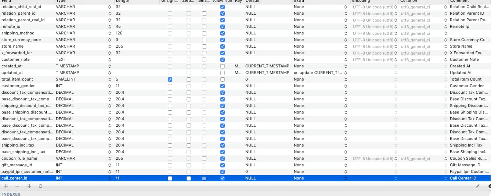
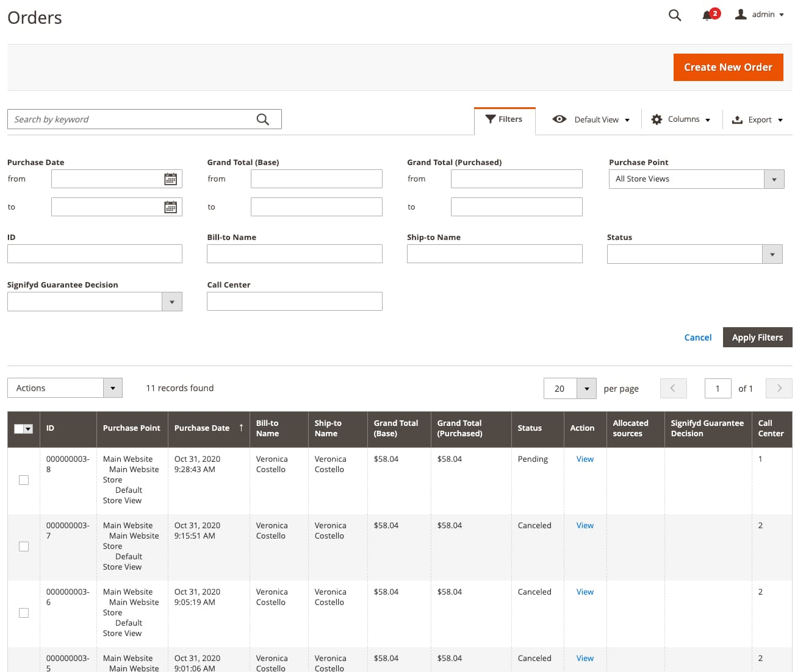

We develop Magento Ecommerce that help our client build Ecommerce website also Order management. We have a lot of
customization on admin page to make order management workflow more efficient.

This story begins when we have 2 call center companies that want to use the same Magento admin site to create order. We should
recognize who was created order. So we decided that we create new custom field on sales order and show that information to the sales order grid.

Let's start:

## Step 1
We should make new custom module. We create 2 new files `app/code/Khoaln/Sales/registration.php` and `app/code/Khoaln/Sales/etc/module.xml`

## Step 2
Add your custom column in Database using `InstallSchema.php`, our column is `call_center_id`.

```php
public function install(SchemaSetupInterface $setup, ModuleContextInterface $context)
{
    $setup->startSetup();
    $this->addCallCenterIdToSalesOrder($setup);
    $setup->endSetup();
}

protected function addCallCenterIdToSalesOrder($setup)
{
    $connection = $setup->getConnection();
    $connection->addColumn(
        $setup->getTable('sales_order'),
        'call_center_id',
        [
            'type' => \Magento\Framework\DB\Ddl\Table::TYPE_INTEGER,
            'nullable' => true,
            'comment' => 'Call Center ID',
        ]
    );
    $connection->addColumn(
        $setup->getTable('sales_order_grid'),
        'call_center_id',
        [
            'type' => \Magento\Framework\DB\Ddl\Table::TYPE_INTEGER,
            'nullable' => true,
            'comment' => 'Call Center ID',
        ]
    );
}
```

After add lines of code, you can run install this module and see what is new in database.
I run  the command `bin/magento setup:upgrade`



### Step 3
At this stage, it would be good to understand how `sales_order_grid` table populated.

When the order is placed, data related to this order is selected from `sales_order` table joining several additional tables and inserted
 to the `sales_order_grid`.  You can look at the `\Magento\Sales\Model\ResourceModel\Grid::refresh` function and default select is declared in
 `<Magento Sales module>/etc/di.xml`

```xml
 <virtualType name="Magento\Sales\Model\ResourceModel\Order\Grid" type="Magento\Sales\Model\ResourceModel\Grid">
        <arguments>
            <argument name="joins" xsi:type="array">
                <item name="sales_shipping_address" xsi:type="array">
                    <item name="table" xsi:type="string">sales_order_address</item>
                    <item name="origin_column" xsi:type="string">shipping_address_id</item>
                    <item name="target_column" xsi:type="string">entity_id</item>
                </item>
                <item name="sales_billing_address" xsi:type="array">
                    <item name="table" xsi:type="string">sales_order_address</item>
                    <item name="origin_column" xsi:type="string">billing_address_id</item>
                    <item name="target_column" xsi:type="string">entity_id</item>
                </item>
                <item name="sales_order_payment" xsi:type="array">
                    <item name="table" xsi:type="string">sales_order_payment</item>
                    <item name="origin_column" xsi:type="string">entity_id</item>
                    <item name="target_column" xsi:type="string">parent_id</item>
                </item>
            </argument>
        </arguments>
</virtualType>
```

You only care about this when you want to join another table.

In this case, because our data already in the `sales_order` table we just need to add new column in Order Grid

```xml
<virtualType name="Magento\Sales\Model\ResourceModel\Order\Grid" type="Magento\Sales\Model\ResourceModel\Grid">
    <arguments>
        <argument name="columns" xsi:type="array">
            <item name="call_center_id" xsi:type="string">sales_order.call_center_id</item>
        </argument>
    </arguments>
</virtualType>
```

About how to assign call_center_id to `sales_order` table base on the admin user. We will talk later in other post.

### Step 4
Add your custom column in sales_order_grid by created file `app/code/Khoaln/Sales/view/adminhtml/ui_component/sales_order_grid.xml`
and extend the `ales_order_grid` UI component

```xml
<?xml version="1.0" encoding="UTF-8"?>
<listing xmlns:xsi="http://www.w3.org/2001/XMLSchema-instance" xsi:noNamespaceSchemaLocation="urn:magento:module:Magento_Ui:etc/ui_configuration.xsd">
    <columns name="sales_order_columns">
        <column name="call_center_id">
            <argument name="data" xsi:type="array">
                <item name="config" xsi:type="array">
                    <item name="filter" xsi:type="string">text</item>
                    <item name="label" xsi:type="string" translate="true">Call Center</item>
                </item>
            </argument>
        </column>
    </columns>
</listing>

```

Just that, now refresh cache and see the result in admin page.



Maybe sometimes you will ask yourself, how can Magento handle it? Please look at this function in
`vendor/magento/module-sales/Observer/GridSyncInsertObserver.php`

```php
   /**
     * Handles synchronous insertion of the new entity into
     * corresponding grid on certain events.
     *
     * Used in the next events:
     *
     *  - sales_order_save_after
     *  - sales_order_invoice_save_after
     *  - sales_order_shipment_save_after
     *  - sales_order_creditmemo_save_after
     *
     * Works only if asynchronous grid indexing is disabled
     * in global settings.
     *
     * @param \Magento\Framework\Event\Observer $observer
     * @return void
     */
    public function execute(\Magento\Framework\Event\Observer $observer)
    {
        if (!$this->globalConfig->getValue('dev/grid/async_indexing')) {
            $this->entityGrid->refresh($observer->getObject()->getId());
        }
    }
```

So the just call the function `refresh` from `Grid` class in `sales_order_save_after` event and update back to the `sales_order_grid` table.

## Conclusion

I think this is the basic step when you want to be a magento developer. Hope this post can help you get more knowledge about magento.
If you want to see all the code please check https://github.com/khoa-le/magento-sales-order-customize.