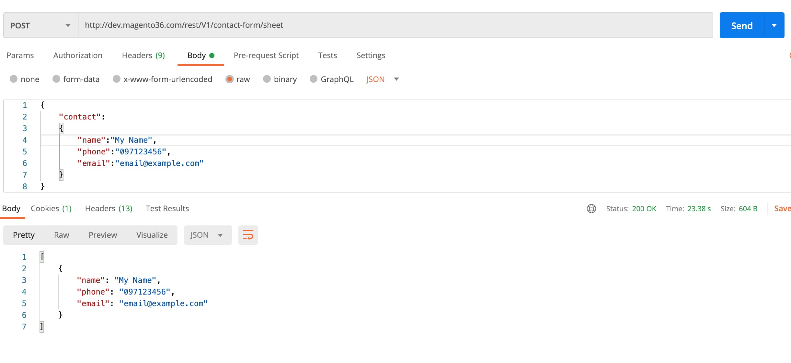
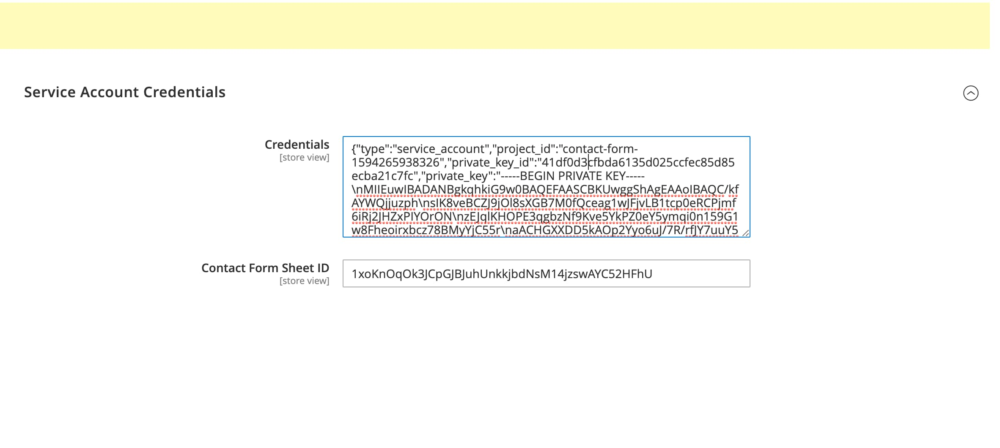
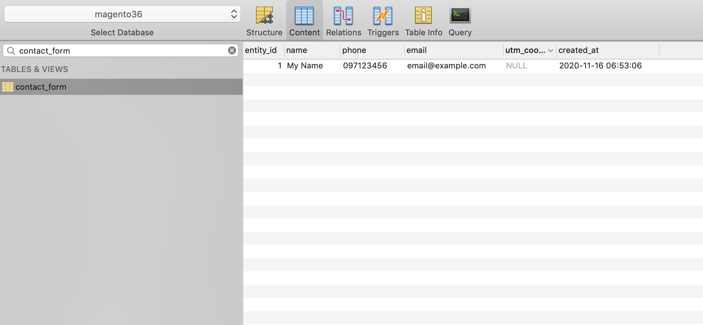
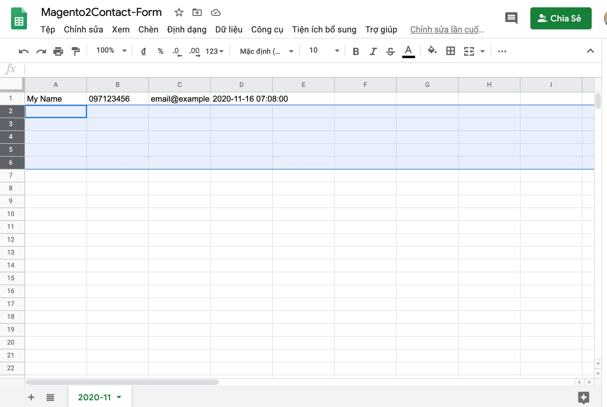

This week, we just launched a function for client's Ecommerce site that show the contact form when user clicked
on the call button out of a working hour ( that time, Call Center can't support and receive calls).

So we develop a form that receive a registration include name and phone number/email from visitors and automatically sync to
Google SpreadSheet. _Everything Should Be Made as Simple as Possible._

> **Disclaimer**: You should care about Google Sheet Limitation.
>
> This version of the Google Sheets API(v4) has a limit of 500 requests per 100 seconds per project, and 100 requests per 100 seconds per user.
>
> Limits for reads and writes are tracked separately. There is no daily usage limit.
>
> <a href="https://developers.google.com/sheets/api/limits" target="_blank">Read More</a>

In this post you will know how easy and simple to import magento data to Google SpreadSheet, you can apply any kinds
of data you want to import. 1 Bonus about how we create magento to Rest Api with our custom entity.

Let's start:

### 1. Create Module with Setup/InstallSchema.php

```php
/**
     * {@inheritdoc}
     * @SuppressWarnings(PHPMD.ExcessiveMethodLength)
     */
    public function install(SchemaSetupInterface $setup, ModuleContextInterface $context)
    {
        /**
         * Create table 'contact_form'
         */
        $table = $setup->getConnection()
            ->newTable($setup->getTable('contact_form'))
            ->addColumn(
                'entity_id',
                \Magento\Framework\DB\Ddl\Table::TYPE_INTEGER,
                null,
                ['identity' => true, 'unsigned' => true, 'nullable' => false, 'primary' => true],
                'Entity ID'
            )
            ->addColumn(
                'name',
                \Magento\Framework\DB\Ddl\Table::TYPE_TEXT,
                255,
                ['nullable' => false, 'default' => ''],
                'name'
            )
            ->addColumn(
                'phone',
                \Magento\Framework\DB\Ddl\Table::TYPE_TEXT,
                255,
                ['nullable' => true, 'default' => NULL],
                'phone'
            )
            ->addColumn(
                'email',
                \Magento\Framework\DB\Ddl\Table::TYPE_TEXT,
                255,
                ['nullable' => true, 'default' => NULL],
                'email'
            )
            ->addColumn(
                'created_at',
                \Magento\Framework\DB\Ddl\Table::TYPE_TIMESTAMP,
                null,
                ['nullable' => false, 'default' => \Magento\Framework\DB\Ddl\Table::TIMESTAMP_INIT]
            )
            ->setComment("Google Sheet Contact Form table");
        $setup->getConnection()->createTable($table);
    }
```

After that, complete the Model Class like Magento standard:

`Model/ContactForm.php`
```php
class ContactForm extends \Magento\Framework\Model\AbstractModel implements \Magento\Framework\DataObject\IdentityInterface
{
    const CACHE_TAG = 'contact_form';

    protected function _construct()
    {
        $this->_init(\Khoaln\Contact2GoogleSheet\Model\ResourceModel\ContactForm::class);
    }

    public function getIdentities()
    {
        return [self::CACHE_TAG . '_' . $this->getEntityId()];
    }
}
```

`Model/ResourceModel/ContactForm.php`
```php

class ContactForm  extends \Magento\Framework\Model\ResourceModel\Db\AbstractDb
{
    protected function _construct()
    {
        $this->_init('contact_form', 'entity_id');
    }
}
```

### 2. Create Api Interface:

We want to use that function anywhere, no matter from EC site or client's landing page. We will expose that like a service.
The next step is build Contact Form API:

Add Method `save` as service contract in `Api/ContactFormInterface.php`

```php
interface ContactFormInterface
{
    /**
     * @param ContactFormDataInterface $contact
     * @return mixed
     */
    public function save(ContactFormDataInterface $contact);
}
```

Implement Class for Service Contract in `Model/GoogleSheet/ContactForm.php`
```php
class ContactForm implements ContactFormInterface
{
    /**
     * @param ContactFormDataInterface $contact
     * @return false|mixed|string
     */
    public function save(ContactFormDataInterface $contact)
    {
        return ['success' => true];
    }
}
```

Define Data Contact in `Api/Data/ContactFormDataInterface.php`

```php
interface ContactFormDataInterface
{
    const NAME  ='name';
    const PHONE  ='phone';
    const EMAIL  ='email';

    /**
     * @return string
     */
    public function getName();

    /**
     * @param string $name
     * @return ContactFormDataInterface
     */
    public function setName($name);

    /**
     * @return string
     */
    public function getPhone();

    /**
     * @param string $phone
     * @return ContactFormDataInterface
     */
    public function setPhone($phone);

    /**
     * @return string
     */
    public function getEmail();

    /**
     * @param string $email
     * @return ContactFormDataInterface
     */
    public function setEmail($email);
}
```

Implement Class for Data Contract in `Model/GoogleSheet/ContactFormData.php`

```php
class ContactFormData  extends AbstractSimpleObject implements ContactFormDataInterface
{
    public function getName()
    {
        return $this->_get(self::NAME);
    }

    public function setName($name)
    {
        return $this->setData(self::NAME, $name);
    }

    public function getPhone()
    {
        return $this->_get(self::PHONE);
    }

    public function setPhone($phone)
    {
        return $this->setData(self::PHONE, $phone);
    }

    public function getEmail()
    {
        return $this->_get(self::EMAIL);
    }

    public function setEmail($email)
    {
        return $this->setData(self::EMAIL, $email);
    }
}
```

The final step, to expose service we will define xml config:

In `etc/di.xml`
```xml
<?xml version="1.0"?>
<config xmlns:xsi="http://www.w3.org/2001/XMLSchema-instance" xsi:noNamespaceSchemaLocation="urn:magento:framework:ObjectManager/etc/config.xsd">
    <preference for="Khoaln\Contact2GoogleSheet\Api\ContactFormInterface" type="Khoaln\Contact2GoogleSheet\Model\GoogleSheet\ContactForm"/>
    <preference for="Khoaln\Contact2GoogleSheet\Api\Data\ContactFormDataInterface" type="Khoaln\Contact2GoogleSheet\Model\GoogleSheet\ContactFormData"/>
</config>
```

Add route in `etc/webapi.xml` to available for all visitors.

```xml
<route url="/V1/contact-form/sheet" method="POST">
    <service class="Khoaln\Contact2GoogleSheet\Api\ContactFormInterface" method="save"/>
    <resources>
        <resource ref="anonymous"/>
    </resources>
</route>
```

Now on this step, we can test the input and output of our service. Open Postman or any tool can call an API.



### 3. Create Main Function that will import directly from our Api to Google SpreadSheet.

Preparation:
* Create Account and Project on https://console.cloud.google.com/
* Enable Google Drive API
* Create Service Account that will execute evey update on your google sheet (Why we use service account? please read it https://developers.google.com/identity/protocols/oauth2/service-account)
* Create Google spreadsheet and add editor role for service account we created above.

If you have trouble with these steps, You can see more details in <a target="_blank" href="https://firebearstudio.com/blog/how-to-export-magento-2-to-google-sheets.html">here</a>

We will use Google Drive API so that we install google api php sdk: `google/apiclient v2.0.0`.

Added dependency in `composer.json`

```json
{
    "name": "khoa-le/magento-contact-2-google-sheet",
    "description": "Import Contact Data to Google SpreadSheet",
    "require": {
        "php": "~7.3.22",
        "google/apiclient": "~2.0.0"
    },
    "type": "magento2-module",
    "version": "2.3.5.2",
    "license": "MIT",
    "autoload": {
        "files": [
            "registration.php"
        ],
        "psr-4": {
            "Khoaln\\Contact2GoogleSheet\\": ""
        }
    }
}
```

Now, let's start the interesting part. We will implement the function that will append data to Google SpreadSheet.
Add these lines of code in `Model/GoogleSheet/Api.php`

```php
class Api
{
    /**
     * @var \Google_Client $_client
     */
    private $_client;

    /**
     * @var \Khoaln\Contact2GoogleSheet\Helper\Data
     */
    private $_dataHelper;

    /**
     * ContactForm constructor.
     * @param \Khoaln\Contact2GoogleSheet\Helper\Data $dataHelper
     */
    public function __construct(
        \Khoaln\Contact2GoogleSheet\Helper\Data $dataHelper
    )
    {
        $this->_dataHelper = $dataHelper;
    }

    public function append( $contact)
    {
        $client = $this->getClient();
        $service = new \Google_Service_Sheets($client);
        $range = date('Y-m', time());
        $spreadsheetId= $this->_dataHelper->getContactFormSheetId();
        try {
            return $this->appendRow($service, $spreadsheetId, $range, $contact);
        } catch (\Exception $ex) {
            $body = new \Google_Service_Sheets_BatchUpdateSpreadsheetRequest(array(
                'requests' => array(
                    'addSheet' => array(
                        'properties' => array(
                            'title' => $range
                        )
                    )
                )
            ));
            $service->spreadsheets->batchUpdate($spreadsheetId, $body);
            return $this->appendRow($service, $spreadsheetId, $range, $contact);
        }
    }
    private function appendRow($service, $spreadsheetId, $range, $contact)
    {
        // Create the value range Object
        $valueRange = new \Google_Service_Sheets_ValueRange();
        $valueRange->setValues(["values" => $contact]); // Add two values
        $conf = ["valueInputOption" => "RAW"];
        return $service->spreadsheets_values->append($spreadsheetId, $range, $valueRange, $conf);
    }
    private function getClient()
    {
        if (!$this->_client) {
            $credential = $this->_dataHelper->getCredential();
            $client = new \Google_Client();
            $client->setScopes([
                \Google_Service_Sheets::SPREADSHEETS,
            ]);
            //Set Service account key that config in project
            //https://console.cloud.google.com/iam-admin/serviceaccounts/details/101147339843886042602;edit=true?previousPage=%2Fapis%2Fcredentials%3Fproject%3Dsuntory-wellness-1594265938326&project=suntory-wellness-1594265938326
            $client->setAuthConfig($credential);
            $this->_client = $client;
        }

        return $this->_client;
    }
}
```

We have used a configuration for 2 params on Mangento Admin, these are Service Account Credential and Google Sheet ID


On pieces of code above, you can focus on 2 functions `getClient` and `appendRow` that help you manipulate data on Google SpreadSheet easily.

Next step, we will complete the main implementation of API in `save()` function on `Model/GoogleSheet/ContactForm.php`.

```php
class ContactForm implements ContactFormInterface
{
    /**
     * @var \Khoaln\Contact2GoogleSheet\Model\ResourceModel\ContactForm
     */
    private $contactForm;
    /**
     * @var Api
     */
    private $googleApi;
    /**
     * @var DateTime
     */
    private $dateTime;
    /**
     * @var \Khoaln\Contact2GoogleSheet\Model\ContactFormFactory
     */
    private $contactFormFactory;

    /**
     * ContactForm constructor.
     * @param \Khoaln\Contact2GoogleSheet\Model\ContactFormFactory $contactFormFactory
     * @param \Khoaln\Contact2GoogleSheet\Model\ResourceModel\ContactForm $contactForm
     * @param Api $googleApi
     * @param DateTime $dateTime
     */
    public function __construct(
        \Khoaln\Contact2GoogleSheet\Model\ContactFormFactory $contactFormFactory,
        \Khoaln\Contact2GoogleSheet\Model\ResourceModel\ContactForm $contactForm,
        \Khoaln\Contact2GoogleSheet\Model\GoogleSheet\Api $googleApi,
        DateTime $dateTime
    )
    {
        $this->contactFormFactory = $contactFormFactory;
        $this->contactForm = $contactForm;
        $this->googleApi = $googleApi;
        $this->dateTime = $dateTime;
    }

    /**
     * @param ContactFormDataInterface $contact
     * @return false|mixed|string
     */
    public function save(ContactFormDataInterface $contact)
    {
        if (!empty($contact->getName()) && (!empty($contact->getPhone()) || !empty($contact->getEmail()))) {
            $gmt7time = date("Y-m-d H:i", strtotime('+7 hours'));
            $createdAt = $this->dateTime->formatDate($gmt7time);
            try {
                $contactFormData = $this->contactFormFactory->create();
                $contactFormData->setData("name", $contact->getName());
                $contactFormData->setData("phone", $contact->getPhone());
                $contactFormData->setData("email", $contact->getEmail());
                $result = $this->contactForm->save($contactFormData);
                if ($result) {
                    $this->appendGoogleSheet($contact, $createdAt);
                }
            } catch (\Exception $exception) {
                throw  new CouldNotSaveException(__($exception->getMessage()));
            }
        } else {
            throw new InputException(__("Please fill the information"));
        }
        return [];
    }

    private function appendGoogleSheet($contact, $createdAt)
    {
        $row = [
            $contact->getName(),
            $contact->getPhone(),
            $contact->getEmail(),
            $createdAt,
        ];
        return $this->googleApi->append($row);
    }
}
```

The final step, We test again our Api to check It works like we imagined.
* Call Rest Api `/rest/V1/contact-form/sheet` with POST data:
```json
{
    "contact":
    {
        "name":"My Name",
        "phone":"097123456",
        "email":"email@example.com"
    }
}
```

* Get 200 respone and check Database and Google Sheet.






## Conclusions

The keys why we use Google SpreadSheet instead Magento Admin page:
* Rollout function quickly. We can measure and know what we want to experiment.
* Allow other people, partners, out source companies can access our data quickly.
* The fewer people can access to Magento Admin, the more secure our Magento takes.

You can find my ready-to-use magento module on Github: https://github.com/khoa-le/magento-contact-2-google-sheet .

