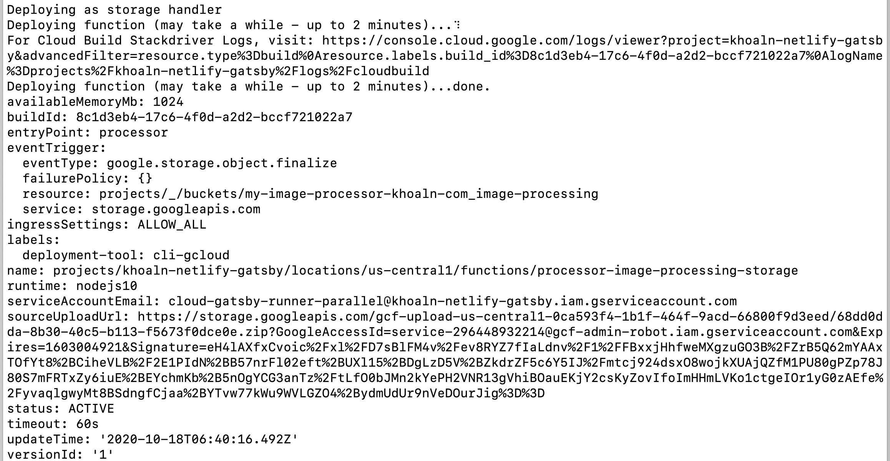

This weekend, I forked kentcdodds.com repository and made my personal website. This site used Gatsby and deploy to Netlify so I will do
the same.

After 1 day to remove un-necessary things. I'm already to deploy my website to Netlify. The configuration just place in simple file `netlify.toml`

```toml
[[headers]]
  for = "/rss.xml"
  [headers.values]
    Access-Control-Allow-Origin = "*"

[[plugins]]
  package = "netlify-plugin-gatsby-cache"

[build]
  command = "npm run netlify"
  functions = "public/functions/"
```

What is the **netlify-plugin-gatsby-cache** plugin? The answer from Jason Lengstorfl is "Persist the Gatsby cache between Netlify builds for huge build speed improvements! ⚡️"

This is the [Repo](https://github.com/jlengstorf/netlify-plugin-gatsby-cache). In there, we can get very detailed about how to install.

Basically, We have 2 ways to install plugin on your application:
  - [One click install from Netlify](http://app.netlify.com/plugins/netlify-plugin-gatsby-cache/install)
  - Install manually on `netlify.toml`. (This is option that I chose)
```toml
[build]
  publish = "public"

[[plugins]]
  package = "netlify-plugin-gatsby-cache"
```

Next, We continue look and see what is the `npm run netlify` do? This is a shortcut of [**gatsby-parallel-runner**](https://github.com/netlify/gatsby-parallel-runner).
After spent 8 hours to setup Google Cloud Function that can use to run parallel gatsby images but I was fail.

And the article that help my life from Netlify is [Gatsby Build Speed Improvements With Parallel Image Processing](https://www.netlify.com/blog/2020/02/25/gatsby-build-speed-improvements-with-parallel-image-processing/)
Follow step by step on the local development. I deployed success Google Cloud Function that can help speed up processing images.




